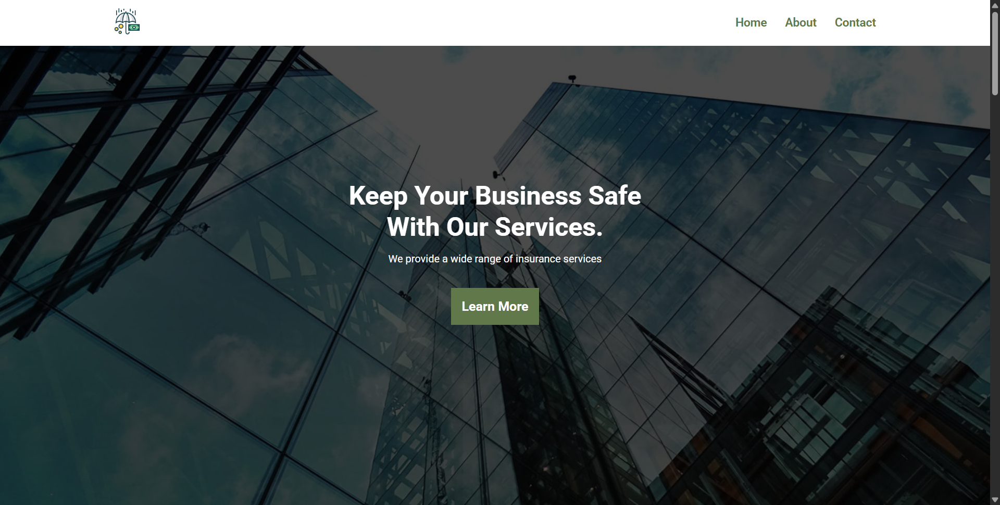

# Insurance Consulting AMP

A responsive website template built with HTML, CSS, and some JS libraries.



## Live Demo

[Click here](https://insurance-consulting-amp.netlify.app/) to view the live demo of the website.

## Github Project

[Click here](https://github.com/Safeya-Yasien/iti_4_assignments/tree/main/html/day_3_lab_1/mobiries_insurance_consulting_amp) to view the Github project.

## Getting Started

To get a local copy up and running follow these simple example steps.

### Prerequisites

- Git
- Node.js
- NPM

### Installation

1. Clone the repo

```sh
git clone https://github.com/SafeyaYasien/mobiries-insurance-consulting-amp.git
```

2. Install NPM packages

```sh
npm install
```

3. Start the server

```sh
npm run dev
```

4. open live server

## Authors

👤 **Safeya Yasien**

- Github: [@SafeyaYasien](https://github.com/Safeya-Yasien)
- Porfolio: [Safeya Yasien](https://safeya-yasien-portfolio.netlify.app/)
- Linkedin: [Safeya Yasien](https://www.linkedin.com/in/safeya-yasien-2ba9b4260/)

## Show your support

Give a ⭐️ if you like this project!

<!-- enhancing the readme -->

- add responsive
- add menu icon in header
- add slider in hero section
- enhance all imgs in all sections
- convert all imgs to webp
- compress all imgs after converting to webp
- add favicon in meta tag
- active links in header and add href to them
- add hover to info section
- edit team img rounded not circle exactly there is a problem

